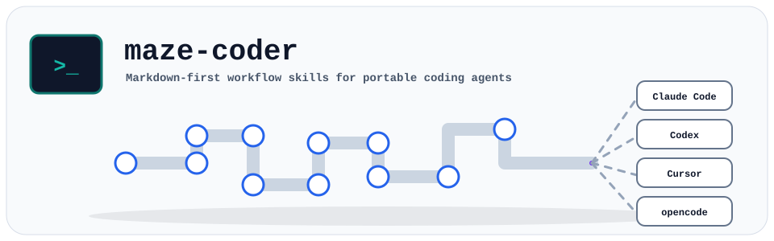

# maze-coder

<p align="center">
  
</p>

**Adaptive Harness Engineering Skills Pack** — 共用安全與完成契約，同時保留前沿模型的原生代理能力。

## 19 Canonical Skills

| Skill | 用途 |
|---|---|
| `maze-idea-to-spec` | 模糊想法 → spec |
| `maze-spec-hardening` | 補強工程契約與驗收條件 |
| `maze-project-init` | 初始化專案文件與 GitHub 設定 |
| `maze-spec-to-issues` | spec → GitHub Issues Dry Run／同步 |
| `maze-session-closeout` | 同步 Git、GitHub、STATUS 與 NEXT_ACTION |
| `maze-github-safe-ops` | 安全 Git／PR／Issue 關聯 |
| `maze-design-review` | 前端設計審查 |
| `maze-qa-verification` | 規格驗收與 QA 報告 |
| `maze-repo-map` | Repo 結構地圖 |
| `maze-context-audit` | 上下文一致性稽核 |
| `maze-bug-reproduction` | Bug 最小重現文件 |
| `maze-handoff-summary` | 跨工具／人員交接 |
| `maze-token-efficiency-review` | 執行 trace 與 token 效率稽核 |
| `maze-risk-driven-tdd` | 低上下文、風險導向的行為驗證與實作 |
| `maze-skill-authoring` | 評估是否新增或擴充技能 |
| `maze-grill` | 逐題壓力測試，不產生文件 |
| `maze-grill-with-docs` | 壓力測試並同步必要領域文件 |
| `maze-grilling` | Grill 共用邏輯（internal） |
| `maze-domain-modeling` | 領域模型與重大決策同步（internal） |

## Adaptive Model

```text
core invariants + Guidance Profile + optional Model Overlay
→ one relevant skill → on-demand references → evidence-based completion
```

`skills/` 是 source of truth。Adapter 使用精簡 Router；依能力選擇 `minimal`、`standard` 或 `scaffolded`，只有具體失敗才加強 Guidance。

## Install

```bash
# Claude Code
cp -r adapters/claude-code/.claude /your-project/

# Codex
cp adapters/codex/AGENTS.md /your-project/
cp -r adapters/codex/.maze-coder /your-project/

# Cursor
cp -r adapters/cursor/.cursor /your-project/

# opencode
cp adapters/opencode/AGENTS.md /your-project/
cp -r adapters/opencode/.maze-coder /your-project/
```

## Sync and Validate

```bash
bash scripts/sync-adapters.sh
bash scripts/validate-skillpack.sh
bash scripts/validate-skills-functional.sh
```

同步腳本只更新受管理的 Adapter／根模板；連續執行兩次時，第二次應輸出 `no changes`。

## Structure

```text
assets/     品牌與視覺資產
core/       不變量與自適應工作模型
profiles/   三級 Guidance Profile
model-overlays/ 輕量模型偏差修正
skills/     19 個來源技能及按需資源
adapters/   四種工具的 Router 與資源包
templates/  由技能模板同步的使用者文件
scripts/    同步與驗證
docs/       maze-coder 自身規格與狀態
```

## Contributing

1. 只修改 `skills/`、`core/` 或同步腳本的 source of truth。
2. 執行同步、結構驗證與功能驗證。
3. 確認第二次同步無差異後再提交 PR。

[MIT License](LICENSE)
